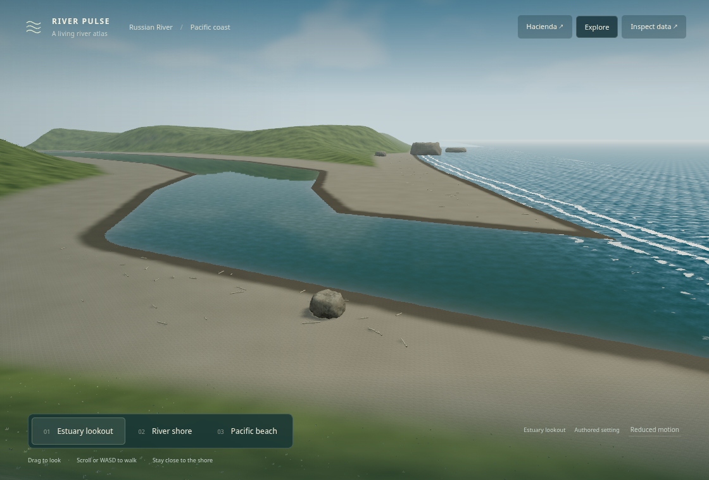
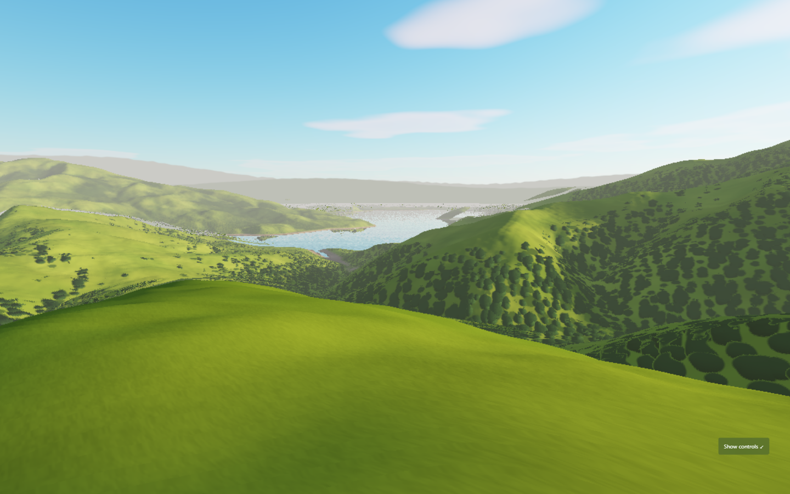
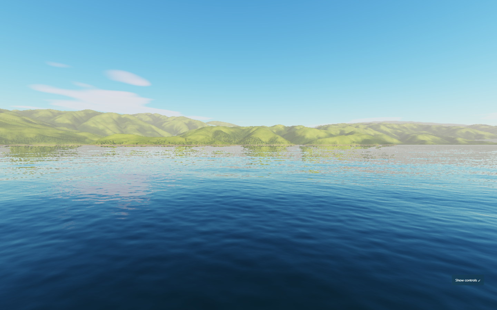
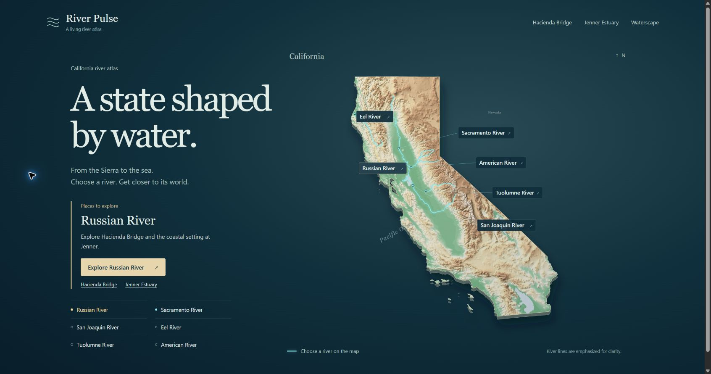
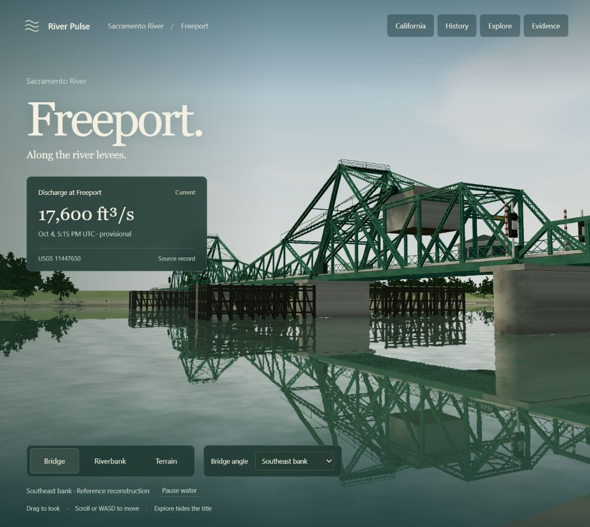
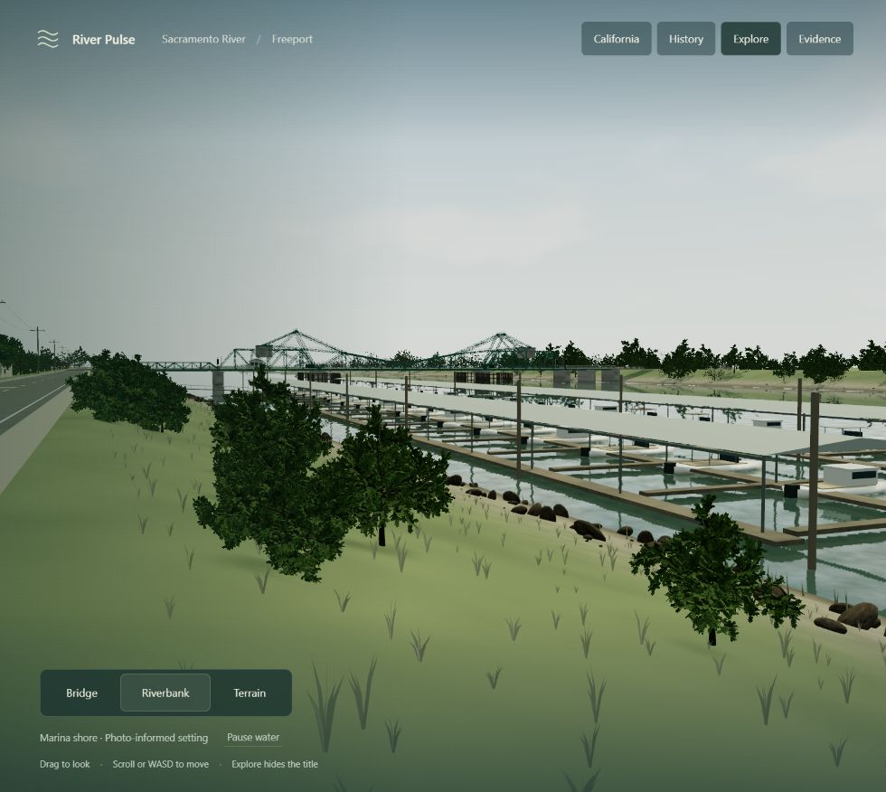

# Waterscape

**Making water visible.** Waterscape is an umbrella for explorable visual representations of
real water systems. Public data supplies the evidence; scientific state and explicit visual
bindings connect that evidence to landscapes, charts, animation and interaction.

A curated [Waterscape resource library](resources/README.md) tracks useful web graphics,
simulation, rendering and visual-development references, including the upstream licence
status for each resource.

**[Explore River Pulse at Hacienda Bridge →](https://boxwrench.github.io/waterscape/river-pulse/renderer/hacienda.html)**
Switch between the blue animated Map river and photo-informed Bridge/Hacienda Beach views,
with USGS discharge, history and seasonal context alongside the scene.

| Experience | What it shows | Status |
|---|---|---|
| [Reservoirs](https://boxwrench.github.io/waterscape/) | Calaveras, San Antonio, Crystal Springs, San Andreas and Hetch Hetchy (with O'Shaughnessy Dam): lidar landscapes, sourced context, modeled water optics and aerial maps | Live journey and WebGPU explorer |
| [River Pulse](https://boxwrench.github.io/waterscape/river-pulse/) | Hacienda Map with a flow-scaled water ribbon; authored gray steel bridge, rock outcrop, pebble beach and green reflective water; USGS discharge/history | Live prototype; illustrative water and authored setting, no local hydrodynamic model |

**[Explore Jenner estuary →](https://boxwrench.github.io/waterscape/river-pulse/renderer/jenner.html)**
[Scene notes](docs/river-pulse/jenner-scene.md), with Estuary lookout,
River shore and Pacific beach. Photo-informed sand spit, Goat Rock, green coastal bluffs,
green estuary water and teal Pacific surf; the separate USGS card reports NAVD88 water level
at Highway 1. Open [Jenner locally](http://localhost:5173/river-pulse/renderer/jenner.html) after
building and starting the server. Supported capabilities
in a manifest are not promises of current data availability.







## Making water visible

Water systems are hard to understand because their most important processes are invisible.
Waterscape's guiding principle is to make them visible: *real data provides the backbone,
science determines the relationships, and visual interpretation makes those relationships
visible.* Every visual binding is one of four kinds: **exact** (directly presents a scientific
quantity), **derived** (a defined visual transformation of scientific state), **illustrative**
(emphasis of a supported concept without claiming literal physical accuracy) or **setting**
(the grass, trees and sky that make people want to look, kept plausible for the place but
carrying no scientific claim). Binding class describes the presentation; provenance and modeling
status stay with the underlying state. Exaggeration is allowed when it clarifies, and every
scientific claim must trace to a source, calculation or clearly identified illustrative
interpretation. The full principle is in
[docs/making-water-visible.md](docs/making-water-visible.md).

## How a reservoir frame is made

- **Land** — the water body's USGS 3DEP lidar is a triangle mesh drawn by
  [three.js](https://threejs.org) on the page's WebGPU device.
- **Water** — a CUDA program ([`renderer/water.cu`](renderer/water.cu)), compiled to WebGPU by
  [cuda-webshader](https://github.com/SamG-Coder/cuda-webshader), simulates FFT waves and
  click ripples, then traces refraction, caustics and reflections. It reads each pixel's
  distance to the land from the three.js pass, so land and water meet exactly.
- **Light** — three hand-tuned presets (Morning, Midday, Golden hour) set the sun, a Preetham
  sky with drifting clouds, fill light and haze.
- **Quality** — the renderer picks a tier from the GPU and adapts tier and resolution to hold
  ~30 fps; a chip shows the GPU in use and how to switch a laptop to its faster one.
- **Everyone else** — browsers without WebGPU get the flyover video and the same facts.

## River Pulse views



The local [river atlas](http://localhost:5173/river-pulse/) shows California's relief
and selectable river courses. It includes Sacramento,
San Joaquin, Eel, Tuolumne and American River entries alongside the Russian River.
Sacramento now opens a [Freeport scene](http://localhost:5173/river-pulse/renderer/freeport.html)
with a detailed reference bridge, eight bridge angles, marina shore, levee roads,
riverfront buildings and sourced Terrain views,
plus USGS discharge and separate history.
The other four are planned placeholders. Select Russian River to open Hacienda or a
planned river to open its individual page. See the
[Freeport scene notes](docs/river-pulse/sacramento-freeport-scene.md). These additions are local,
pending review and publication.





Map keeps sourced terrain and river centerlines. Its blue water ribbon widens/narrows with
selected discharge relative to the loaded history; seasonal condition colors the border.
Ripple scale and motion are exaggerated. Width is a visual comparison, not measured banks,
stage, inundation or velocity; zero/missing discharge stops motion.

Bridge and Hacienda Beach use an approximate photo-informed local setting: gray steel span,
left-pier rock, gray pebble shore and grouped woodland. Green water has reflections,
refraction, modeled bed detail and approximate caustics. Shore movement stays near the water
at eye height. Timeline changes preserve this static authored shoreline.
See the [River Pulse guide](river-pulse/README.md) and
[scene, sources and rendering notes](docs/river-pulse/authored-water.md).

## Add a reservoir

Any US lake, reservoir or pond with 3DEP lidar coverage can become a stop:

1. `python pipeline/locate.py "<NHD lake name>" <biome>` drafts `data/<id>/source.json` — name,
   biome, a lon/lat box around the water and an on-water anchor point.
2. `python pipeline/build.py <id>` — downloads the lidar and aerial photograph and writes the
   terrain, cameras and map inset.
3. Write `data/<id>/story.json` (facts, each with an https source) and `data/<id>/land.json`
   (the look: light presets, season, grass, trees, fog, water colour).
4. `node pipeline/render-flyover.mjs <id>` — renders the flyover video and poster.
5. Add the stop to a tour in `data/tours/`, run `npm test`, and publish with GitHub Pages.

The full guide, with field references and examples, is
[docs/make-a-waterscape.md](docs/make-a-waterscape.md).

## Run locally

Requires Node.js 20+ and Chrome or Edge. On Windows, double-click **`START.bat`**; otherwise:

```
npm ci
npm start
```

Open **http://localhost:5173/** for the journey, or
**http://localhost:5173/renderer/explore.html?reservoir=calaveras** for reservoir 3D,
or **http://localhost:5173/river-pulse/** for the River Pulse prototype.
Jenner is at **http://localhost:5173/river-pulse/renderer/jenner.html** after `npm run build`.

Both experiences share one install and server. Hacienda terrain and river centerlines are
committed, so starting River Pulse does not require a fresh geometry download. Live gauge/history requests
need network access and explicitly show unavailable data when a source fails.

In reservoir live 3D: drag or arrow keys to look; W/A/S/D to fly, E/Q up and down; scroll sets speed,
Shift boosts (speed also grows with height above the ground). Click water for ripples, Space
pauses, H hides the controls. The panel sets wave energy, basin depth, exposure, season,
light, resolution and lens glare; PNG saves the frame.

URL options: `?reservoir=<id>`, `?preset=morning|midday|golden`, `?quality=low|medium|high`
(pins a tier), `?t=<seconds>` (fixed wave time); the journey takes `?tour=<tour>`.

## Repository layout

| Path | What it is |
|---|---|
| `river-pulse/` | River-specific adapters, scientific state, visual bindings, renderer and place packages |
| `resources/` | Curated web graphics, simulation, rendering and workflow references with upstream licence status |
| `docs/making-water-visible.md` | Shared principles: binding class is separate from scientific provenance |
| `docs/river-pulse/` | River-specific implementation contract, reuse audit and roadmap notes |
| `index.html`, `site/` | The journey page (videos, facts, "Explore in 3D") |
| `renderer/explore.*` | The live 3D page: controls, input and readouts |
| `renderer/engine/` | The engine: `waterscape.js` (runtime, kernels, frame), `body.js`, `camera.js`, `quality.js`, `presets.js` |
| `renderer/land/` | three.js land pass: terrain mesh, depth → distance pack |
| `renderer/water.cu` | All water simulation and image formation (CUDA, shared with the native host) |
| `data/<id>/` | One folder per water body: `source.json` (inputs), terrain, cameras, story, land profile, flyover, poster |
| `data/biomes/<biome>/` | Reusable assets per landscape type (`diablo-oak` today) |
| `data/tours/<tour>.json` | Journeys: ordered stops |
| `pipeline/` | Builds and checks water bodies: `build.py`, `render-flyover.mjs`, `validate-bundles.mjs` |
| `vendor/` | cuda-webshader and three.js, vendored (the site loads nothing from CDNs) |
| `Native/` | Optional native Windows CUDA host (developer tool) |
| `docs/` | [Architecture](docs/architecture.md), [make a waterscape](docs/make-a-waterscape.md), design history; see also the [roadmap](ROADMAP.md) |

## Tests

```
npm run test:unit
npm run validate
npm run test:build
npm test
```

The first three checks cover both experiences without launching a GPU browser. Python pipeline
checks (including river terrain and registry generation) require `numpy scipy Pillow pytest`:
`python -m pytest pipeline/tests -q`. CI runs these checks plus shader compilation. The full
`npm test` additionally launches Edge for the reservoir browser suite; Windows Chrome/Edge
are the primary live-3D targets.

Serves itself, compiles all 20 CUDA kernels, validates every water body, biome and tour, and
drives Edge through Playwright: FFT correctness, optics, zero readbacks in the frame loop,
ripples, viewpoints, presets, resizing, quality tiers and the journey. Pipeline tests:
`python -m pytest pipeline/tests -q`.

## Scope

The **reservoir renderer** models still water only — one water level inside a shoreline. Landforms and shorelines come from
lidar (~10 m); everything finer is procedural or from shared biome assets. Lidar flattens
water, so the bed is modelled as banks falling about 1:3 to the chosen basin depth, and the
water level is the level at survey time. Outside the lidar crop the land falls away under
painted far ridges.

River Pulse keeps absolute river elevation, spatial gauge state, source quality and explicit
time-selection policies separate from that reservoir model. It reuses utilities where the
contracts already match; reservoir waves and synthetic beds are not river hydrodynamics.
See [repository architecture](docs/architecture.md) and the
[River Pulse guide](river-pulse/README.md). Future water-system experiences can add their own
state and visual bindings under the same umbrella without a speculative shared framework.

## Credits and licences

- Water optics: [Clearwater](https://github.com/Aureliengmz/clearwater) by Aurélien / Lumaris
  (MIT) and its CUDA reimplementation [SamG-Coder/clearwater](https://github.com/SamG-Coder/clearwater) (MIT).
- [cuda-webshader](https://github.com/SamG-Coder/cuda-webshader) (MIT) and
  [three.js](https://github.com/mrdoob/three.js) r186 (MIT), vendored under `vendor/`.
- Terrain: USGS 3D Elevation Program, public domain. Facts: public records cited per fact.
- References: Tessendorf (FFT water), Evan Wallace (caustics), Preetham et al. (sky),
  Inigo Quilez (texture repetition), Olano & Baker (LEAN mapping).

MIT licence ([`LICENSE`](LICENSE)); third-party notices in [`THIRD_PARTY_NOTICES.md`](THIRD_PARTY_NOTICES.md).
