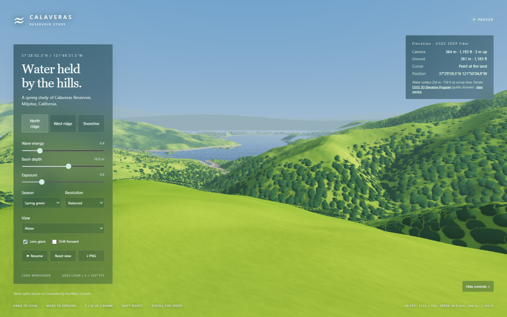

# Waterscape

**Hydrology, simulated.** A journey through California's water, starting with the Hetch Hetchy Regional Water System: real lidar landscapes, reservoir optics, and the public data behind each place. Every stop plays a pre-rendered flyover on any device; WebGPU-capable devices can switch to the live renderer and explore.

## Layout

| Path | What it is |
|---|---|
| `index.html`, `site/`, `journey.json` | The journey page (video tier, live-tier switch) |
| `renderer/` | The live CUDA→WGSL→WebGPU renderer (`explore.html?reservoir=<id>`) |
| `data/<id>/` | One bundle per reservoir: terrain, cameras, story, flyover, poster |
| `pipeline/` | Builds bundles: `build_bundle.py` (USGS 3DEP terrain + cameras), `render-flyover.mjs` (video), `validate-bundles.mjs` |

## Adding a reservoir

1. Add an entry to `pipeline/reservoirs.json` (name, biome, lon/lat bbox, grid size, and an on-water anchor lat/lon).
2. `python pipeline/build_bundle.py <id>` (needs numpy, scipy, Pillow).
3. Write `data/<id>/story.json`; every fact needs an https source.
4. `node pipeline/render-flyover.mjs <id>` (Edge + ffmpeg; uses the discrete GPU).
5. Add the stop to `journey.json`, then `npm test`.



All simulation and image formation lives in [`src/clearwater.cu`](src/clearwater.cu). The browser executes it through [cuda-webshader](https://github.com/SamG-Coder/cuda-webshader): CUDA source → generated WGSL → WebGPU. JavaScript handles controls, resources, dispatch and presentation. There is no WebGL, Three.js, handwritten WGSL, CPU wave simulation or CPU FFT.

## Run locally

Requires Node.js 20+ and a WebGPU-capable browser.

On Windows, double-click **`START.bat`**. It starts the local server and opens the experience. To run it manually:

```powershell
npm ci
npm start
```

Open **http://localhost:5173/renderer/explore.html**.

- Choose **Overlook** for the Calaveras Road composition or **Shoreline** for the shallow-water view.
- Switch between the March-inspired **Spring green** palette and **Summer gold**.
- Drag or use arrow keys to look. WASD flies, E rises and Q descends.
- Scroll changes travel speed; Shift provides a temporary 6× boost. Speed also scales with height above the ground (1× below 25 m, 20× at 500 m), so climbing with E is the fast way across the basin.
- Click nearby water to create ripples. Space pauses and H hides the controls.
- Adjust wave energy, basin depth, exposure, resolution, diagnostics and lens glare.
- PNG exports the current frame. `?t=5` starts at a fixed wave time.

## CUDA pipeline

| Stage | Implementation |
|---|---|
| Spectrum | Seeded Gaussian complex coefficients, directional spectral bumps and GPU RMS slope normalization |
| Reservoir surface | Three independently seeded 256² cascades spanning 4.6 m, 37 m and 293 m, clipped by an irregular shoreline |
| Terrain | Ray-traced procedural near bank plus a world-oriented ridge layer for stable distant hills and reflections |
| Materials | Spring/summer grass, exposed shoreline, sediment, clustered oak shading and distance haze |
| Interaction | 256² camera-relative ripple field, 16 m wide, fixed 120 Hz wave equation |
| Caustics | 1024² refracted rays, three refractive indices, fixed-point splats into a 512² RGB field |
| Water optics | Fresnel reflection, Snell refraction, Beer–Lambert extinction, underwater scattering and pebble/sediment seabed |
| Lens/output | Diffraction, bloom, filmic tone curve and direct GPU-buffer-to-canvas copy |

The normal frame loop performs **zero GPU-to-CPU readbacks**. Explicit inspection and PNG export read data back on request. The compiler/runtime graph is vendored; no runtime CDN is needed.

## Verification

```powershell
npm run check
npm test
```

`npm test` serves itself; no separate server is needed. The suite compiles all 20 CUDA entries and launches Microsoft Edge through Playwright. It checks FFT correctness, optical energy, finite buffers, zero render-loop readbacks, ripple interaction, viewpoint/reset behavior, seasonal controls, resizing, diagnostics, PNG export and reservoir classification. Latest evidence is in [`previews/verification.json`](previews/verification.json).

## Scope and tradeoffs

Landforms, shoreline and elevations come from USGS 3DEP lidar; everything finer than the ~10 m grid (grass, oaks, bank detail, sub-grid relief) is procedural. Lidar flattens water, so the reservoir bed is modelled as banks falling at about 1:3 to the interface's basin depth. The water level is the level at the time of the lidar survey (≈224 m). Outside the ~9 × 11 km crop, the land falls away under painted, hazy far ridges.

`python pipeline/build_bundle.py` regenerates `data/<id>/terrain.*` bin.gz and its `.json` metadata from the USGS service (needs numpy, scipy, Pillow). The shader's `TERRAIN_*` constants are checked against that metadata at startup. `--native` also writes the uncompressed `.bin` the native host loads.

The water is bounded visually while its FFT fields remain periodic underneath. This is a linear spectral height field, not volumetric water; it does not model sediment transport or changing reservoir levels. The distant hills are a directional landscape layer, while nearby banks use the traversable height field. Caustics and the pebble bed are intentionally strongest in the Shoreline view.

The browser and optional native Windows host share `src/clearwater.cu`. The native host remains a developer-oriented compatibility target and requires Windows, CUDA Toolkit 13.x, Visual Studio C++ Build Tools and an NVIDIA GPU.

## Provenance

- Original Clearwater: [Aureliengmz/clearwater](https://github.com/Aureliengmz/clearwater), commit `4bc826134321043a25df3c2b6fed16fb7b9241e8`, MIT, copyright 2026 Lumaris.
- CUDA reimplementation: [SamG-Coder/clearwater](https://github.com/SamG-Coder/clearwater), MIT.
- Pebble image: extracted without modification from the original embedded asset into `assets/seabed.jpg`.
- CUDA WebShader: vendored compiler and runtime, MIT; license at `vendor/cuda-webshader/LICENSE`.
- Terrain: USGS National Map 3D Elevation Program (3DEP), public domain, fetched from the [3DEPElevation ImageServer](https://elevation.nationalmap.gov/arcgis/rest/services/3DEPElevation/ImageServer) by `scripts/build-terrain.py`.
- Original design references: Tessendorf (FFT water), Evan Wallace (refracted-grid caustics), Inigo Quilez (texture repetition), Olano & Baker (LEAN Mapping).

The original license is retained in [`LICENSE`](LICENSE), with additional notices in [`THIRD_PARTY_NOTICES.md`](THIRD_PARTY_NOTICES.md).
