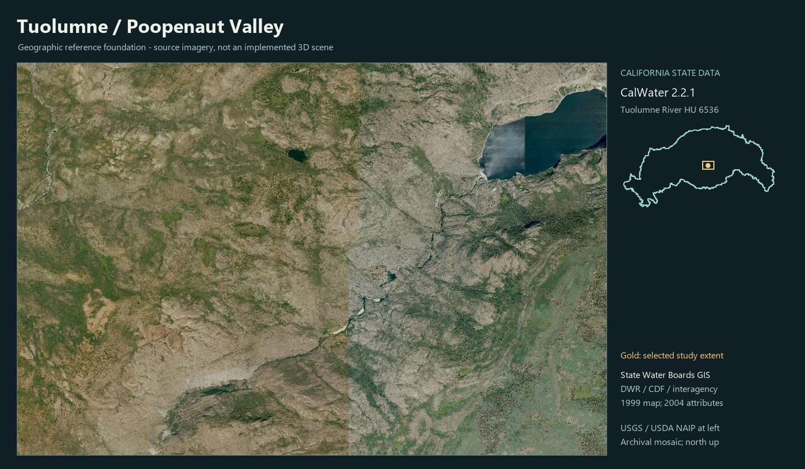

# Tuolumne River: Poopenaut Valley foundation

This records the RP19 source-data checkpoint. RP21 now adds an actual
[plain-form runtime and visual review](./notes/tuolumne-visual-review.md); the river is
in development and visual acceptance remains pending.

RP19 starts the next river in parallel with Eel's source audit. The first place is
Poopenaut Valley and its upstream transition to O'Shaughnessy Dam. It connects an
existing Waterscape reservoir to a distinct downstream river environment. NPS
[river context](https://www.nps.gov/yose/getinvolved/trp.htm) explicitly identifies
this sequence, and its [management map](https://www.nps.gov/yose/learn/management/upload/trpmgmtzoningmap.pdf)
provides geographic context. This is a data/research foundation, not a rendered
scene, a finished river package or an accepted visual baseline.



The reference sheet uses downloaded USGS/USDA NAIP imagery and actual state
CalWater polygon coordinates. It is a source-data diagram, not concept art or a
runtime screenshot. The watershed inset is a longitude/latitude outline with
longitude scaled by the cosine of the study latitude; no area measurement or
survey-scale accuracy is claimed. The gold rectangle marks the authored study
window. The state data is used, attributed and featured rather than listed alone.

## Acquired sources

All source bundles are under
`river-pulse/data/tuolumne_river/foundation/poopenaut/`.

| Source | Actual use | Limits |
|---|---|---|
| USGS National Map 3DEP | `terrain.json` and `terrain.bin.gz`: 768 x 512, **14.66 m** square cells; 888.9-2141.0 m NAVD88; EPSG:32611 | Generic service mosaic resampled by the export. Unexaggerated elevations, not a native 1 m lidar grid. Encoding step 0.05 m is precision, not spatial resolution or accuracy. Acquisition year/source project not established. |
| California Water Boards / CalWater 2.2.1 | `calwater.json`: downloaded HU **TUOLUMNE RIVER / 6536** and hydrologic area **Hetch Hetchy / 65366**; actual watershed outline on the reference sheet | State/interagency boundaries finalized in 1999, attributes updated May 2004. Administrative as well as drainage boundaries; not a legal jurisdiction map or present inundation. Original NAD83 Teale Albers reference retained; query geometry returned as WGS84 via outSR 4326. |
| USGS 3DHP | `hydrography.json`: **278** mapped flowline features intersecting the study window, including the named Tuolumne | Source features can extend beyond the queried window. No inference of current width, stage, discharge or bathymetry. Full requested query and retrieval time retained. |
| USGS/USDA NAIP | `aerial.jpg` / `aerial.json`: **1536 x 1024** archival mosaic aligned to DEM cell edges | Mosaic acquisition year not resolved. Aerial texture is not modeled vegetation, structures or current water conditions. Public-domain source credit retained. |
| NPS Tuolumne River Plan / Poopenaut trailhead | Place choice, downstream sequence and reference leads | Geographic/visual context; not current access advice, gauge observations or hydraulic inputs. |

CalWater is state/interagency authored geography, served by the California State
Water Resources Control Board. Its preserved attribution lists DWR, CDF, DFG,
SWRCB, Teale and federal partners. Hosting and authorship are recorded separately
from USGS federal terrain and hydrography. The downloaded [current public service](https://gispublic.waterboards.ca.gov/portalserver/rest/services/Hydrology/CalWater_Boundaries/MapServer)
contains original metadata and exact query URLs. Do not treat source `SHAPE_Area`
as a new UI measurement without defining projection and uncertainty.

## One-metre lidar availability

A specific suitable lead exists: **Yosemite National Park: Poopenaut Valley and
Wawona**, OpenTopography collection **CA10_Stock**, DOI
[10.5069/G99W0CDM](https://portal.opentopography.org/datasetMetadata?otCollectionID=OT.022013.26911.1).
The fetched primary metadata identifies airborne lidar acquired **August 11-13,
2010**, NCALM collector, Greg Stock/NPS principal investigator, NSF funding,
**1 m raster products**, **CC BY 4.0**, NAD83 (CORS96) UTM 11N, and NAVD88
(GEOID03), metres. The collection includes three irregular survey polygons.

**Availability is verified; the 1 m raster and raw lidar point cloud have not been
downloaded or installed in this foundation.** The metadata's combined bounding
box also includes Wawona; it is not proof of full coverage across this study
window. Obtain the [actual raster footprint](https://raw.githubusercontent.com/OpenTopography/Data_Catalog_Spatial_Boundaries/main/OpenTopography_Raster/CA10_Stock.geojson)
and native DTM tiles, check Poopenaut coverage and reconcile horizontal datums
before using them. Preserve the current broad 3DEP grid for distant context;
introduce fine terrain only where visible and measure cost. Lidar-derived bare
earth does not establish river-bed bathymetry or present river stage.

The existing `data/hetch_hetchy/` reservoir grid is approximately 10.44 m and ends
too far east to cover the broader Poopenaut reach. It is useful for future dam
comparison, but its edited reservoir terrain, detected flat water level and
synthetic bathymetry must not be reused as unmodified river observations.

## Fixed-view plan and next pass

`review-cameras.json` defines five numerical **proposals**: overview, primary
valley composition, eye level, river contact, and upstream dam transition. They
use the river's local x-east/z-south origin and DEM-plus-clearance heights. Seed
19041 is reserved for future scatter; no vegetation scatter has been made.
Camera and target positions are checked against the actual exported DEM extent.
They are authored viewpoints, not surveyed access points or photo-matched views.

The first actual runtime pass must render plain terrain and mapped river layout
before adding water optics, rock, foliage or structures. Resolve the proposed
eye/shore cameras onto a visually confirmed dry bank, version and freeze the
camera set, then capture desktop and phone views. Inspect the valley silhouette,
dam-to-river transition and shoreline/contact before accepting form. Preserve
source/aerial mode alongside the plain form. Use the best existing reservoir
visuals as craft references without importing their scientific assumptions.

Reference leads: NPS [Poopenaut Valley trailhead photo](https://www.nps.gov/places/000/poopenaut-valley-trailhead.htm)
shows a grassy valley within a granite gorge. Its individual photographer/license
is not identified on that page, so it has not been redistributed. A historical
[NPS archive image](https://npgallery.nps.gov/YOSE/AssetDetail/ee7e499ac3484ac282d3cd04db65e223)
by W. R. James, April 1965, lists Public domain in Constraints Information; it shows
Hetch Hetchy from Poopenaut Pass, not the downstream valley. It has not been
downloaded, inspected or treated as a current-condition reference. Its generic
archive coordinate is not a surveyed camera position.

## Review status

- Actual source aerial and generated state-watershed reference sheet inspected.
  River runs southwest out of the dam at the upper right; the imagery visibly
  confirms the valley/dam relationship. Forest cover, exposed granite and a narrow
  winding river give the initial composition its structure. A source mosaic seam
  is visible across the reservoir and must not be mistaken for a physical feature.
- No browser scene exists for this reach. No motion, performance or phone view
  claims; no human visual acceptance claimed.
- At the RP19 checkpoint the river remained `planned`. Foundation stayed outside deployable `places/` so the
  registry cannot advertise terrain research as an available scene.
- Next bounded pass: plain-form runtime review, then a separately reviewed native
  lidar refinement where actual footprint coverage and datum reconciliation permit.

Reproduce acquisition deliberately:

```powershell
python pipeline/build_river_terrain.py river-pulse/data/tuolumne_river/foundation/poopenaut/source.json
python pipeline/build_tuolumne_foundation.py
python pipeline/build_tuolumne_layout.py
python pipeline/render_tuolumne_reference_sheet.py
python pipeline/validate_tuolumne_foundation.py
```

`source.json` uses a versioned unique id because the existing DEM cache keys by
id/zone, not by extent or resolution. Change that id when changing the window/grid
or deliberately remove only its checked cache file. Network acquisition is not
part of normal browser loads or builds. Exact URLs and UTC context retrieval
times are committed; DEM export provenance is the builder's deterministic URL
from `source.json`, not a recovered upstream survey date.
